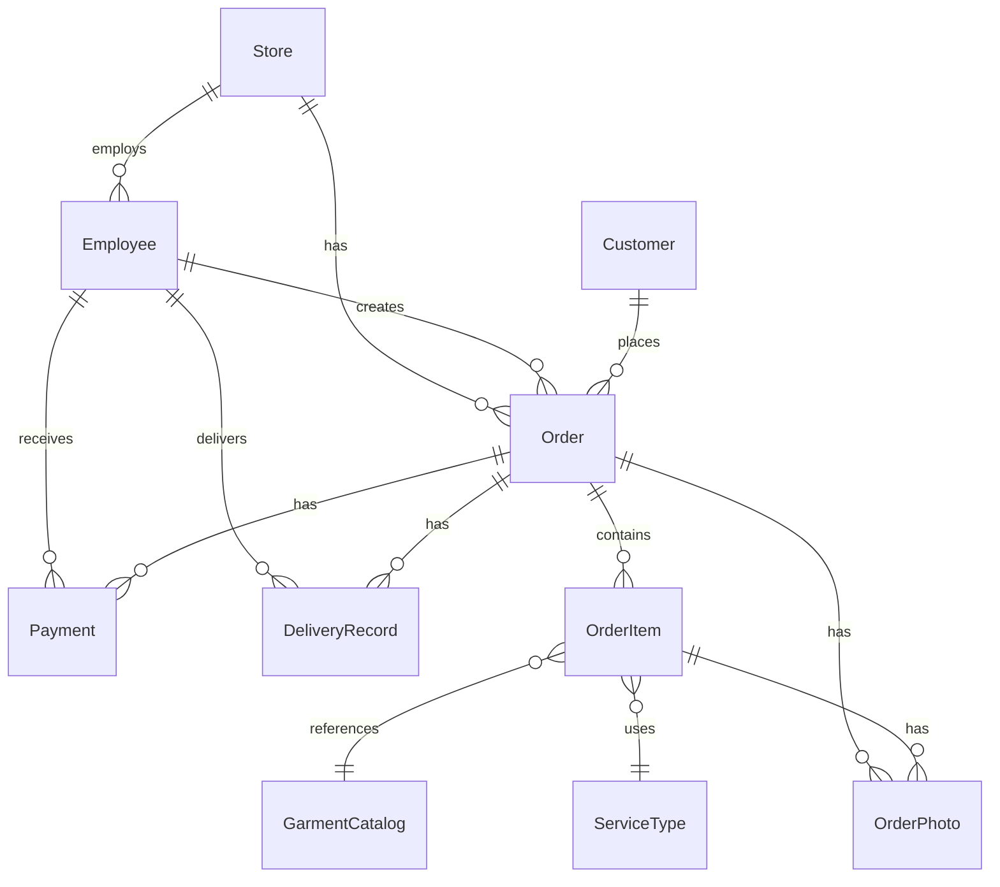

# Database Documentation

## Entity Relationship Diagram

## Entities

### Store

| Field               | Type     | Notes             |
| ------------------- | -------- | ----------------- |
| id                  | CUID     | Primary key       |
| name                | String   | Store/branch name |
| address             | String?  | Physical address  |
| phone               | String?  | Contact number    |
| isActive            | Boolean  | Soft delete       |
| createdAt/updatedAt | DateTime | Audit timestamps  |

### Employee

| Field    | Type    | Notes                          |
| -------- | ------- | ------------------------------ |
| id       | CUID    | Primary key                    |
| name     | String  | Full name                      |
| phone    | String? | Contact                        |
| email    | String? | Unique, optional               |
| pinHash  | String  | bcrypt hashed PIN              |
| role     | Enum    | OWNER/MANAGER/COUNTER/DELIVERY |
| storeId  | FK      | Store assignment               |
| isActive | Boolean | Can login?                     |

### Customer

| Field              | Type    | Notes                              |
| ------------------ | ------- | ---------------------------------- |
| id                 | CUID    | Primary key                        |
| name               | String  | Full name                          |
| phone              | String  | **Unique** — primary identifier    |
| email              | String? | Optional                           |
| address            | String? | Delivery address                   |
| pincode            | String? | Area pincode                       |
| membership         | Enum    | NONE/SILVER/GOLD/PLATINUM          |
| discountPercent    | Float   | Default discount                   |
| preferences        | JSON?   | Fragrance, starch, fold, etc.      |
| registrationSource | String  | WALK_IN/PHONE/WEBSITE/REFERRAL/APP |

### Order

| Field                 | Type     | Notes                                |
| --------------------- | -------- | ------------------------------------ |
| orderNumber           | String   | **Unique** display number (ORD-0001) |
| systemDueDate         | DateTime | Calculated due date                  |
| effectiveDueDate      | DateTime | May differ if overridden             |
| dueDateOverrideReason | String?  | Audit: why was it changed            |
| dueDateOverriddenBy   | String?  | Audit: who changed it                |
| isExpress             | Boolean  | Express processing flag              |
| status                | Enum     | Derived from item statuses           |
| paymentStatus         | Enum     | PENDING/PARTIAL/PAID/REFUNDED        |
| pickupType            | Enum     | STORE_PICKUP/HOME_DELIVERY           |
| priority              | Enum     | STANDARD/EXPRESS/VIP                 |
| syncStatus            | Enum     | For future offline support           |

**Financial Fields:**

| Field            | Type  | Notes              |
| ---------------- | ----- | ------------------ |
| subtotal         | Float | Sum of line totals |
| discountAmount   | Float | Applied discount   |
| expressSurcharge | Float | Express fee        |
| taxAmount        | Float | Tax (future)       |
| totalAmount      | Float | Final amount       |
| amountPaid       | Float | Total received     |
| amountDue        | Float | Remaining balance  |

### OrderItem

| Field             | Type      | Notes                      |
| ----------------- | --------- | -------------------------- |
| garmentCatalogId  | FK        | Which garment              |
| serviceTypeId     | FK        | Which service              |
| quantity          | Int       | Number of garments         |
| unitPrice         | Float     | Price per unit             |
| lineTotal         | Float     | quantity × unitPrice       |
| colorTags         | String[]  | Color descriptions         |
| defectNotes       | String?   | Pre-existing damage notes  |
| itemStatus        | Enum      | RECEIVED through DELIVERED |
| deliveredQuantity | Int       | For partial delivery       |
| itemDueDate       | DateTime? | Per-item due date override |

### Payment

| Field        | Type    | Notes                             |
| ------------ | ------- | --------------------------------- |
| orderId      | FK      | Which order                       |
| amount       | Float   | Payment amount                    |
| mode         | Enum    | CASH/UPI/CARD/ONLINE/STORE_CREDIT |
| reference    | String? | Transaction reference             |
| receivedById | FK      | Employee who recorded             |

## Important Indexes

- `employees`: storeId, role, isActive
- `customers`: phone (unique), name
- `orders`: customerId, status, paymentStatus, orderDate, storeId
- `order_items`: orderId, itemStatus
- `order_photos`: orderId, orderItemId
- `payments`: orderId
- `delivery_records`: orderId, riderId, status

## Important Constraints

- `Customer.phone` is unique — primary customer identifier
- `Employee.email` is unique when provided
- `Order.orderNumber` is unique
- OrderItem cascades on Order delete
- Payment cascades on Order delete
- OrderPhoto cascades on Order delete
- DeliveryRecord cascades on Order delete
